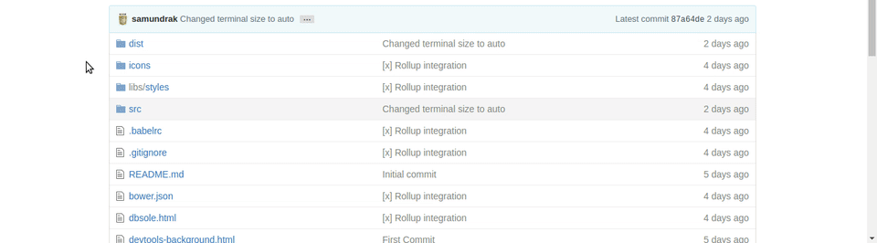

# DBSole (Database on your Console)
Access your database from your Google chrome DevTool. No need to switch over terminal or phpMyAdmin just open your console and start querying !!!!

#Install
  - Its not available on chrome store
  - You can download this as zip file and load on your chrome by going on `chrome://extensions`
  - Developer mode must be enable in order to use this
  - After setting up on chrome download the dbsole server which interacts with mysql
  - `npm i dbsole -g` will install the dbsole be sure to install it globally 
  - If its first time then it will ask for database details like host,user,password and database
  - If the connection is successfull then you  can access database from chrome

#Demo
  

